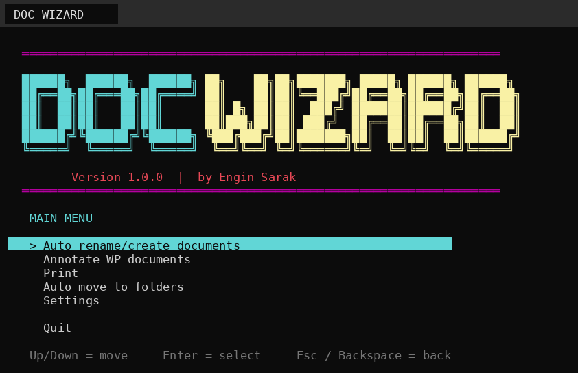
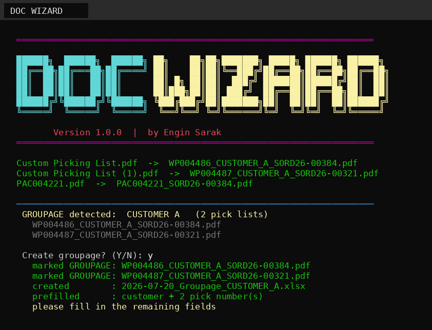
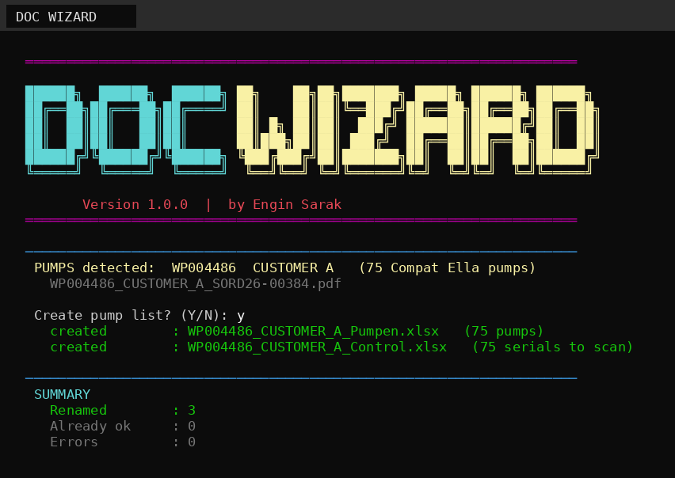
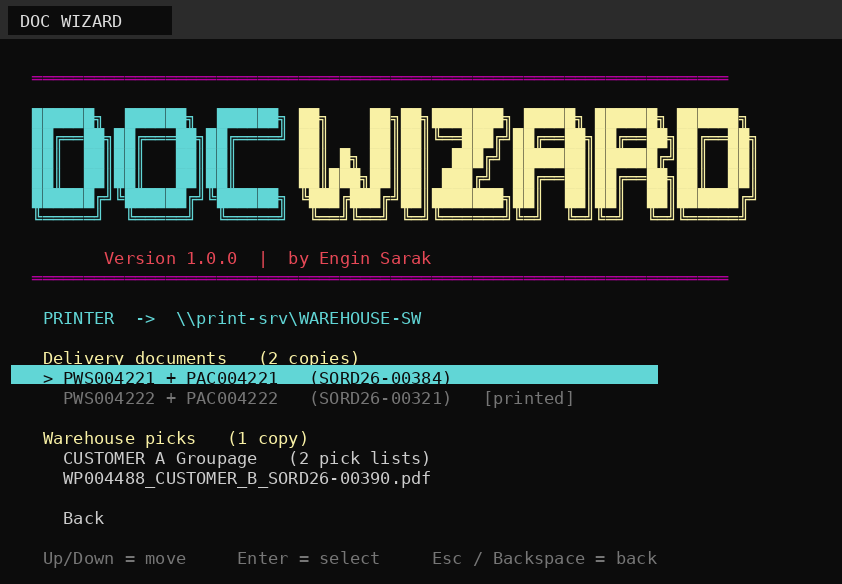
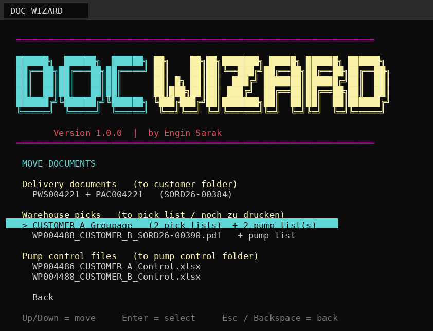
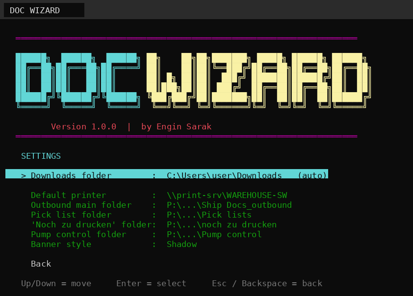
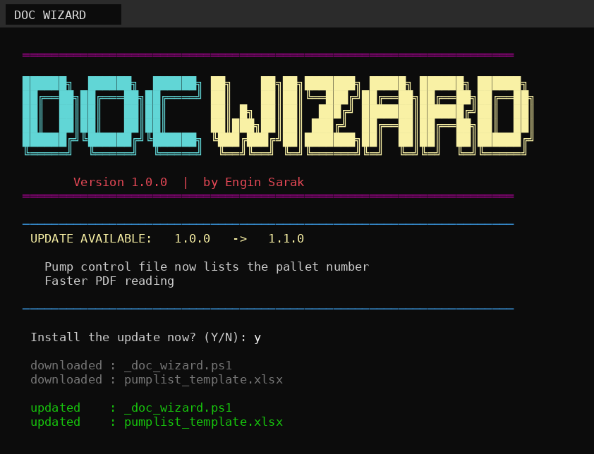

<div align="center">



**DOC WIZARD** · v1.0.5

*A PowerShell-based tool that automates renaming, printing, filing and Excel generation for warehouse pick lists and delivery notes*

*By [Engin Sarak](https://github.com/EnginSarak)*


</div>

---

## Table of Contents

- [How it works](#how-it-works)
- [Features](#features)
  - [Rename and create documents](#rename-and-create-documents)
  - [Pump picks](#pump-picks)
  - [Print](#print)
  - [Move to folders](#move-to-folders)
  - [Settings](#settings)
  - [Self-update](#self-update)
- [Install](#install)
- [Tech stack](#tech-stack)
- [Project structure](#project-structure)
- [Changelog](#changelog)

---

## How it works

Business Central exports pick lists as PDFs with generic names like `Custom Picking
List.pdf`. Getting them into the right filename, the right printer tray and the
right folder is the same handful of steps every time — and building the pump list and
scan sheet for a pump pick means re-typing serial numbers by hand.

DOC WIZARD reads the PDFs directly and does all of that: renaming, stamping, printing,
filing, and generating the Excel sheets from data already sitting in the file. No line
list export, no copy-paste, no template hunting.

Single PowerShell script, no install beyond unzip, keyboard-driven menu, one COM call
into Excel where a formula can't do the job.

---

## Features

### Rename and create documents



Reads PAC / PWS / WP and the order number out of each PDF and renames it accordingly.
When two or more pick lists share a customer, it flags it as a groupage, stamps the
PDFs and builds the groupage sheet from the template with customer and pick numbers
already filled in.

### Pump picks



If a pick list contains pumps, it offers to build two files straight from
the PDF — no line list needed:

- **Pumpen.xlsx** — serial numbers grouped by bin, with counts and a total. Rows still
  sitting in the PICKING bin are excluded.
- **Control.xlsx** — the scan sheet for the warehouse floor. A scanned serial turns
  green, anything still red was missed.

### Print



Delivery documents and warehouse picks in one list. Matched PAC/PWS pairs print
together, deliveries twice, picks once. Anything already sent is marked so it doesn't
go out twice by accident.

### Move to folders



Each entry moves the full bundle — pick list with its pump list, groupage with its
sheet. Control files get their own section and go to the pump control folder, not the
print queue. Delivery documents are routed by reading customer, country and date out of
the PDF and suggesting the matching month folder.

### Settings



Folders and printer are asked once and stored next to the script. `reset.bat` clears
all of it — run it before handing the folder to someone else.

### Self-update



Checks this repository on every start. If a newer version exists it shows the changelog
and asks before touching anything. No prompt if offline or unreachable, no personal
settings ever overwritten.

---

## Install

```
Code → Download ZIP → unpack → run "DOC WIZARD.bat"
```

First start asks for folders and printer once.

---

## Tech stack

| Layer | What |
| --- | --- |
| Runtime | PowerShell 5.1, Windows Console API |
| Spreadsheets | Excel COM interop |
| PDF parsing | Manual PDF stream inflate + text-token extraction, no external library |
| Update channel | Raw file diff against this repo's `main` branch |

---

## Project structure

```
DOC WIZARD/
├── DOC WIZARD.bat              starts the tool
├── _doc_wizard.ps1             the program
├── reset.bat                   clears personal settings
├── update.txt                  version + file list for the updater
├── pumplist_template.xlsx      pump list template
├── pump_control_template.xlsx  scan control template
├── groupage_template.xlsx      groupage sheet template
└── docs/                       screenshots used above
```

`_doc_wizard_settings.txt`, `_doc_wizard_pairs.txt` and `_doc_wizard_printed.txt` are
created at runtime and never leave the machine.

---

## Changelog

### v1.0.5

- Moving a document no longer crashes when a file is open in another program
- New "Check for updates" menu entry that reports the result
- Update check now works behind a company proxy

### v1.0.4

- Clearer message when a groupage already exists

### v1.0.3

- Groupage is no longer offered again when the file already exists from an earlier day

### v1.0.2

- Fixed update check not detecting new versions
- Fixed groupage prompt appearing when already created

### v1.0.1

- Auto rename warns when a PAC document is missing its PWS pair, or vice versa

---

*Customer names and numbers in the screenshots are made up.*
